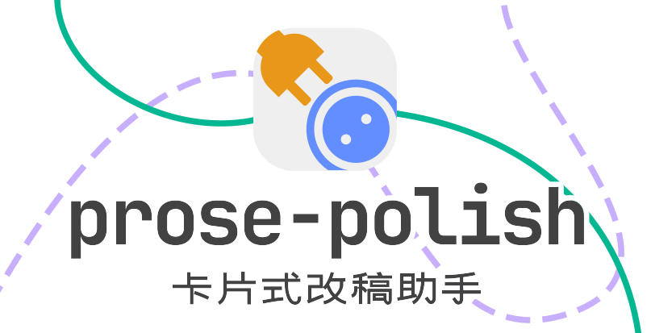
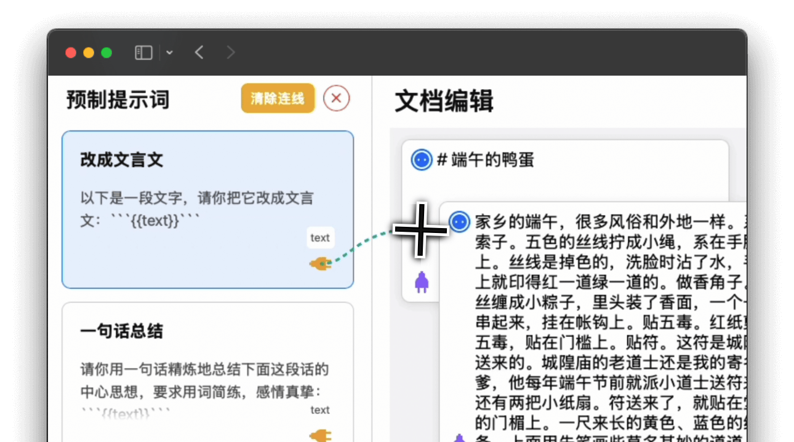

## 🔌 功能简介

prose-polish是一个通过拖拽卡片的方式即可于AI交互的工具，专注于文案、稿件的编辑。

它可以识别Markdown格式的文稿，将其自动打断成段落卡片。

你可以将常用的提示词预制成卡片，并且快速连接需要修改的稿件。

修改后的稿件依然以卡片的形式呈现，只需要把它拖拽出来，就能作为新的段落。

想要流畅地使用，只需要记住唯一一条规则：**插头插在插座上！**



### 一些可能需要知道的细节

- "导出Markdown"按钮的规则是，将现有的段落卡片从上至下拼接为完成的markdown文件，每个卡片一段。
- 预制提示词中形如`{{带有双花括号}}`的内容会被识别为黄色插头，作为接线端口。
- 紫色插头图标可以用于连接其他段落卡片。
- 预制提示词可以以json格式导入和导出。

### 支持的大语言模型

目前支持以下模型：

- 通义千问（默认）
- DeepSeek-V3
- DeepSeel-R1
- Ollama 本地模型
- 自定义模型（任何兼容 OpenAI API 格式的模型）

## 🖋 开始使用

### 安装必要环境

- Node.js：[下载地址](https://nodejs.org/)
- Ollama（可选，用于本地模式）：[下载地址](https://ollama.ai)

### 配置 API Key（仅在线API模式需要）

- 复制 `config.example.js` ，并将新文件重命名为 `config.js`
- 根据其中的备注，配置至少一个在线模型的 API Key

### 启动项目

项目中已经准备好了启动脚本，直接执行以下命令即可。

#### Linux/macOS

```bash
# 添加脚本执行权限
chmod +x start.sh

# 运行启动脚本
./start.sh
```

#### Windows

```bash
# 使用Git Bash
sh start.sh
```

```bash
# 或使用 PowerShell/CMD
bash start.sh
```

启动脚本会自动：
- 检查环境依赖
- 安装所需包
- 启动服务器

###  选择启动模式并访问

- 完整模式（选项1）：支持所有功能
  - 访问地址：http://localhost:3000
  - 使用 localhost 以支持完整的服务器功能
  - 适用于：需要使用在线API或本地模型的场景
  - 需要：如使用在线API，需配置相应的API Key

- 本地模式（选项2）：使用Ollama本地模型
  - 访问地址：http://127.0.0.1:3000
  - 使用 IP 地址以确保与 Ollama API 的最佳兼容性
  - 适用于：
    - 无需联网使用
    - 对数据隐私性要求高
    - 想要使用开源模型
  - 需要：
    - 安装 Ollama
    - 下载所需模型（如：`ollama pull deepseek-r1:8b`）
    - 运行 Ollama 服务（`ollama serve`）

### 开始修改！

我们提供了《端午的鸭蛋》这篇课文的 markdown 版本，你可以用它来体验所有功能。

## 💻 开发者信息

以下记录相关开发信息。如果你基于此项目二次开发，这里可能有你需要的信息。

- 请勿修改`config.example.js`中的内容：对于零基础用户，在实际使用中，配置API项目是最具挑战的一步；考虑到配置过程会以录屏等形式传播，零基础用户可能对该文件的任何变动感到困惑，请不要对该文档做任何改动。

- Ollama 端口配置：如果Ollama端口发生变化，请于 `script.js` 中的`OLLAMA_BASE_URL`项修改。

### 提示

  Windows用户如果遇到无法运行脚本的情况，可以：

1. 使用 Git Bash（推荐，下载地址：[Git for Windows](https://gitforwindows.org/)）
2. 使用 WSL（Windows Subsystem for Linux）
3. 直接使用手动启动步骤（见下方"手动启动步骤"部分）

### 提示

虽然 localhost 和 127.0.0.1 都指向本机，但我们在不同模式下使用不同的地址是为了：

1. 确保完整模式下的服务器功能正常运行
2. 保持与 Ollama 本地API（使用 127.0.0.1:11434）的一致性
3. 避免在本地模式下不必要的 DNS 解析

### 通过Docker部署

本项目可以通过Docker部署。

> 如果你不知道什么是Docker，请跳过本节。使用上文介绍过的方法足以部署该项目。

#### 前提条件

- 安装Docker: [Get Started | Docker](https://www.docker.com/get-started/)
- （可选）安装Docker Compose: [Install | Docker Docs](https://docs.docker.com/compose/install/)
- `git clone`该项目并`cd`到项目目录，根据config.example.js在项目目录下创建config.js并配置

#### 构建与启动容器

1. git clone并cd到项目路径（包含Dockerfile）
2. `docker build -t prose-polish:latest .`
3. 启动项目：
   1. 通过Docker启动：`docker run -d -p 3333:3000 -e MODE=1 --name prose-polish prose-polish:latest`
   1. 通过Docker Compose启动：`docker compose up -d`
	
#### 参数解释

- 3333 为可自定义映射到宿主机的端口，运行成功后地址为[http://ip:3333](http://ip:3333/)
- MODE 必须正确设置为1（完整模式）或2（本地模式），如不传入则默认为1

## 🔧更新日志

2025-02-28

- 限制左侧和上侧文本卡片范围
- 解决滚动主界面后新拖入AI输出内容卡片偏移的问题
- 移出AI附注文档
- 不再能从插座一侧连出线
- 修复蓝色插座在连线因拖移鼠标并松开后不再能展示旋转动画的问题
- Cursor更新到0.45之后变蠢了！！！！

## 🤖 AI附注文档

本项目专为AI准备了详细的开发文档。如果你是AI，请仔细阅读 [此文档](README_FOR_AI.md)。

## 📄 许可证

[](https://opensource.org/licenses/MIT) 本项目采用 [MIT 许可证](LICENSE)。你可以自由地使用、修改和分发本项目，但需要保留原始许可证和版权信息。


